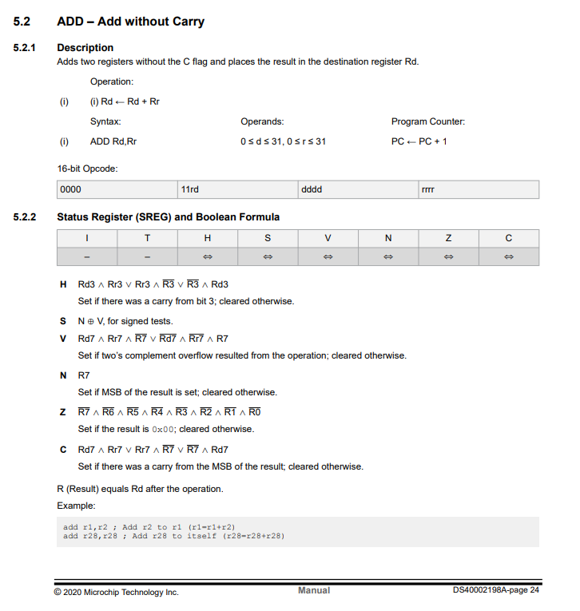

# Instrukcje dodawania nowych operacji do `Step()` w emulatorze AVR



## 📦 Struktura funkcji `Step()`

```go
func (cpu *CPU) Step() {
	instr := cpu.Flash[cpu.PC]
	cpu.PC++

	switch {
	case instr&0xF000 == 0xE000: // LDI
		// ...

	case instr&0xFC00 == 0x0C00: // ADD
		// ...

	default:
		fmt.Printf("Nieznana instrukcja: 0x%04X\n", instr)
		cpu.Halt = true
	}
}
